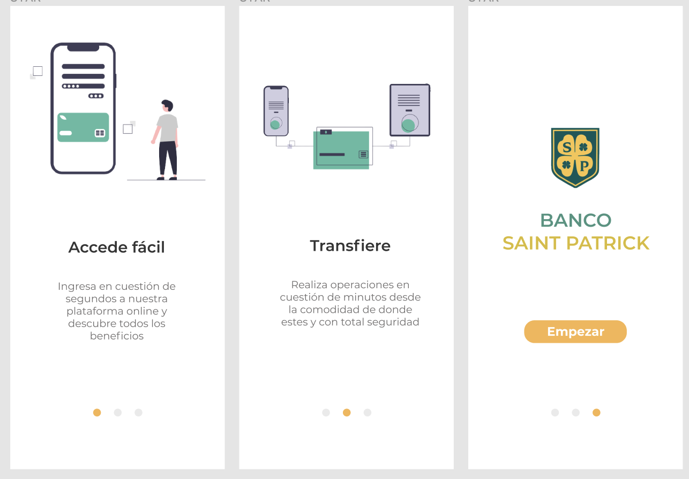
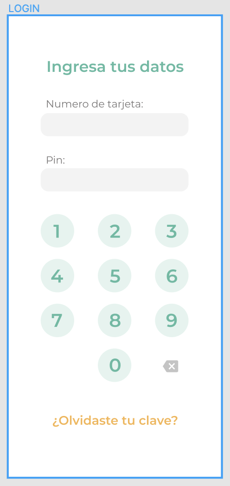
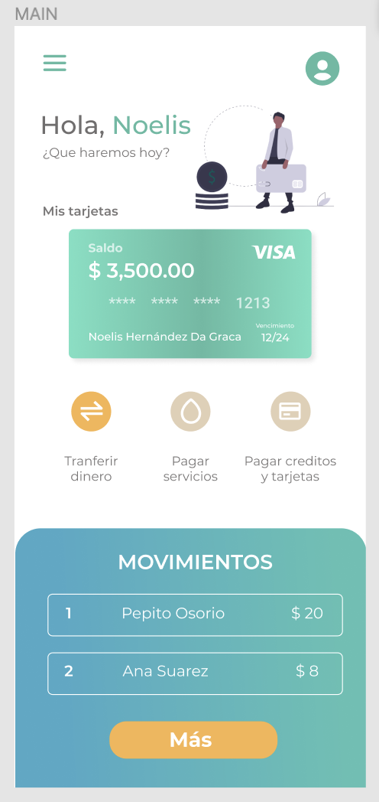
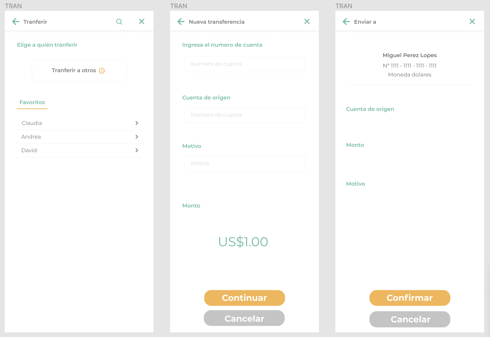
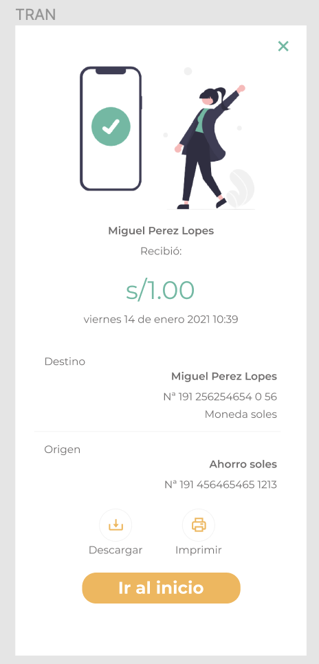

# HOMEBANKING: BANCO SAINT PATRICK

Gracias a la iniciativa de IDforIdeas, la fusión de Perú, Colombia, Argentina, Venezuela y Uruguay, y mucho empeño logramos realiza el homebanking del Banco Saint Patrick, una plataforma totalmente adaptable a móvil, tablet y desktop, la cual confiamos para facilitar la visa de nuestro usuario, el cual puede realizar transferencias con total seguridad y comodidad, además de tener una interfaz amigable

## Indice
- [HOMEBANKING: BANCO SAINT PATRICK](#homebanking-banco-saint-patrick)
  - [Indice](#indice)
    - [Resumen](#resumen)
    - [Prototipo](#prototipo)
    - [Recursos](#recursos)
    - [Herramientas](#herramientas)
    - [Autores](#autores)

### Resumen

- Inicio de Proyecto: Lunes 10/01/2022
- Fin de Proyecto: 
### Prototipo

<h2>Vista inicial</h2>
| Expectativa | Realidad |
|  |  |

<h2>Vista login</h2>
| Expectativa | Realidad |
|  |  |

<h2>Vista main</h2>
| Expectativa | Realidad |
|  |  |

<h2>Vista del proceso de transferencia</h2>
| Expectativa | Realidad |
|  |  |

<h2>Vista de transferencia exitosa</h2>
| Expectativa | Realidad |
|  |  |

### Recursos
- [Figma](https://www.figma.com/file/zZUH7VlheDl3A4haqOdKz5/HOMEBANKING%3A-BANCO-SAINT-PATRICK?node-id=0%3A1)
- [Trello](https://trello.com/b/n5lPU0Br/home-banking)
- [Miro](https://miro.com/app/board/o9J_ljrIUdo=/)

### Herramientas
<h2>FRONTEND</h2>
- Reactjs v17.0.2
- Tailwindcss v3.0.15
- react-router-dom v6.2.1

<h2>BACKEND</h2>
- Nodejs
- Express

 
### Autores

:pencil:	Scrum Master

 
- [x] Bruno - [runobk20](https://github.com/runobk20)
 

:art: UX/UI Designer

- [x] Catherine Choque - [CatherineChoque](https://github.com/CatherineChoque)
 
- [x] Noelis Hernández - [noelishernandezdg](https://github.com/noelishernandezdg)
 

 

:desktop_computer:	Frontend

- [x] Gabriel Jaime Osorio Hernández - [gjaimeosorio](https://github.com/gjaimeosorio)
 
- [x] Andrea Estefania Blanco Avila - [Andu15](https://github.com/Andu15)
 
- [x] Maritza Rodriguez - [Mariperu](https://github.com/Mariperu)
  
- [x] Catherine Choque - [CatherineChoque](https://github.com/CatherineChoque)
  
- [x] Fidel Kelvin Salas Flores - [FksF](https://github.com/FksF)
 

 

:minidisc: Backend

- [x] José Diego Acosta Penta - [DanteDev2102](https://github.com/DanteDev2102)
 
- [x] Santiago Agustín Cometto - [comettosantiago](https://github.com/comettosantiago)
 

 

:white_check_mark:	QA / Tester

 
- [x] Bruno - [runobk20](https://github.com/runobk20)
 

 